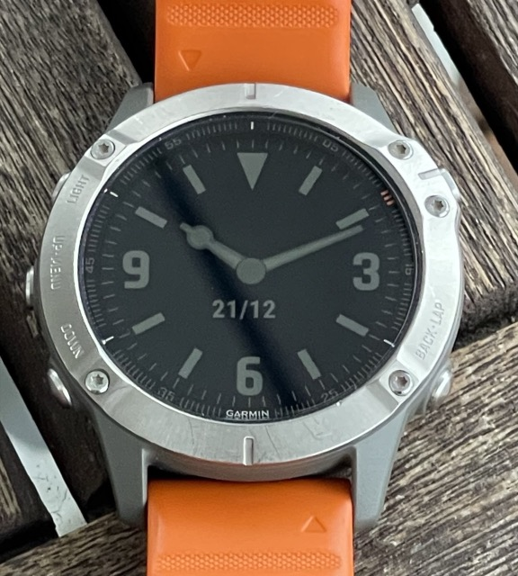

# Garmin Explorer watch face

## A Smiths/Rolex 'Explorer' style watch face

If you want to learn how to make a watch face, check out [this post](https://aviitala.com/posts/garmin-watchface-tutorial/) that explains the key steps.

Below settings can be customised in the Conenect IQ page of the watch face after installation on your device:

* The 12-hour index can be toggled between a triangle and a numeric 12
* Hour hand style can be toggled between a ball-tipped one (shown in images) and an arrow-tip one
* The minute marks around the dial can be toggled on and off
* This watch face adds two customisable datafield indicators similar to my Spectre Runmaster watch face. The data fields move along with the hands to make sure they are always legible (or can be locked to 12/3/6/9), and can be configured in the Connect IQ app as date, battery %, HR, current steps, or blank.

In addition, 'data gauges' can be enabled that display battery % and progress toward your set goal as gauges at the bottom of the watch face, similar to my Matter Metrics watch face.

## Direct install
If you want to directly use the watchface, please head to the [Connect IQ page](https://apps.garmin.com/en-US/apps/4e26376f-806a-4ce7-8bd1-07ad82e52540)

## Source code
This repository contains the full project for this watch face.

## Images

