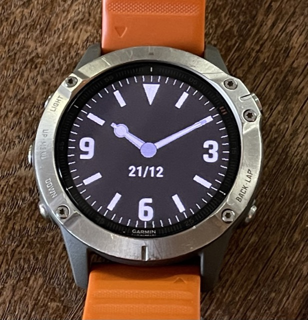
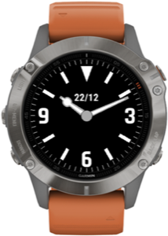

# Garmin Explorer watch face

<!-- Fix badge script URL -->
<!--  -->
<!--  -->

<!-- Download link to Garmin store when available -->

If you want to learn how to make a watch face, check out [this post](https://aviitala.com/posts/garmin-watchface-tutorial/) that explains the key steps.
